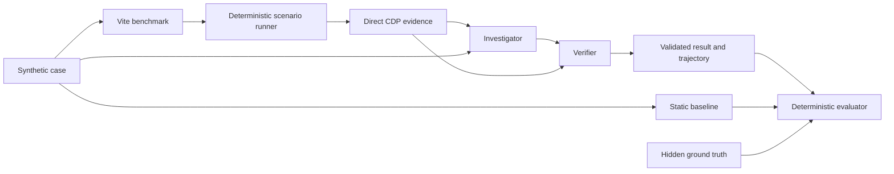

# HeapSleuth

HeapSleuth is an agentic workflow that reproduces frontend interactions in a
real browser, collects post-garbage-collection memory evidence, asks an
Investigator to diagnose the behavior, and asks a Verifier to challenge the
diagnosis.

On the frozen eight-case synthetic MVP cohort, HeapSleuth improved root-cause
localization accuracy (RCLA) from **3/8 (37.5%)** for the static baseline to
**5/8 (62.5%)**. It also improved mechanism classification from **2/7 (28.6%)**
to **4/7 (57.1%)** and the mean evidence-grounding score from **1.0** to
**3.0**. Verdict accuracy was 8/8 for both approaches, so the demonstrated gain
is diagnosis quality, not leak detection alone.

The repository began the competition with `docs/PROJECT_PLAN.md` only. All
source code, benchmark cases, prompts, evaluation artifacts, trajectories, and
submission documentation were created during the hackathon.

> Frontend debugging agents do not primarily need more reasoning. They need
> controlled reproduction, runtime evidence, and permission to reject their
> first hypothesis.

## How it works



The browser runner warms up each route, forces garbage collection when
supported, repeats a fixed mount/unmount interaction, and captures bounded heap,
DOM, listener, and benchmark runtime-state evidence. The model never receives
hidden ground truth. Results are validated with Zod and scored by deterministic
code rather than an LLM judge.

## Fastest review path (no API key)

Requirements: Node.js 20.19.0 or newer and npm.

```bash
npm ci
npm run validate
npm run smoke:benchmark
```

Then inspect:

- [final comparison](results/summary/comparison.md);
- [evaluation methodology](docs/EVALUATION.md);
- [representative Investigator and Verifier trajectories](docs/TRAJECTORIES.md);
- [evidence-driven improvement changelog](docs/IMPROVEMENT_CHANGELOG.md);
- [official submission checklist](docs/SUBMISSION_CHECKLIST.md).

The repository includes the complete frozen evaluation artifacts. Reviewing them
does not require Gemini access.

## Run the benchmark UI

```bash
npm run benchmark
```

Open the exact local URL printed by Vite, then choose a case route such as
`/cases/event-listener`. The root page intentionally shows only a route message
because each benchmark is isolated by case ID.

## Run one live diagnosis

Copy `.env.example` to `.env`, add a Gemini API key with sufficient quota, and
run:

```bash
npm run solution -- --case event-listener
```

The command starts the benchmark automatically, launches a supported Chromium
browser, records runtime evidence, calls the Investigator and Verifier, and
writes validated artifacts. A live run changes the active result for that case,
so use a disposable clone if you want to preserve the submitted cohort
byte-for-byte.

See [the reproduction guide](docs/REPRODUCTION.md) for PowerShell commands,
full-cohort regeneration, environment variables, quota requirements, failure
recovery, and output paths.

## Frozen result

| Metric                   | Static baseline |  HeapSleuth |     Change |
| ------------------------ | --------------: | ----------: | ---------: |
| RCLA (primary)           |     3/8 (37.5%) | 5/8 (62.5%) |   +25.0 pp |
| Leak verdict accuracy    |      8/8 (100%) |  8/8 (100%) |       0 pp |
| Mechanism classification |     2/7 (28.6%) | 4/7 (57.1%) |   +28.6 pp |
| Source localization      |      7/7 (100%) |  7/7 (100%) |       0 pp |
| False positives          |        0/1 (0%) |    0/1 (0%) |       0 pp |
| Mean evidence grounding  |             1.0 |         3.0 |       +2.0 |
| Total measured runtime   |        81.189 s |   206.326 s | +125.137 s |
| Total tokens             |           8,687 |      43,213 |    +34,526 |

The cohort used `gemini-3.6-flash` through the Gemini Interactions provider.
Monetary cost is **not available** in the validated artifacts; the project does
not equate missing billing data or free-tier credentials with a verified zero
cost. The frozen cohort hash is
`6c8c0f3f9fa017deb386e9b947c5a897a41dbb9d152f5157eadea6fa50980dff`.

## Benchmark cases

The MVP has seven deliberately leaking mechanisms and one healthy control: event
listener, interval, ResizeObserver, detached DOM, global cache, closure
registry, event bus, and temporary allocation with correct cleanup. The dataset
stays at eight until all MVP submission criteria pass.

## Evidence and limitations

HeapSleuth demonstrates reproducible behavior on controlled synthetic React
cases. It does not yet accept arbitrary websites or repositories, search
complete heap snapshots, repair code automatically, or establish
production-world accuracy. Heap-size growth alone is never treated as proof; the
benchmark-controlled retained resource signal after forced GC supplies the
stronger evidence. The Investigator and Verifier are independent requests but
use the same model family.

An attempted stricter Verifier prompt reduced RCLA to 3/8 and was removed. Its
artifacts remain under
[`results/iterations/verifier-v2`](results/iterations/verifier-v2/README.md),
preserving the failed experiment instead of presenting only successful
iterations.

## Project map

- `benchmark/`: Vite/React synthetic cases and runtime instrumentation.
- `src/browser/`: deterministic scenario execution and direct CDP evidence
  collection.
- `src/baseline/`: source-only comparison workflow.
- `src/investigator/` and `src/verifier/`: agent prompts, validation, and
  orchestration.
- `src/evaluation/`: frozen-cohort selection and deterministic scoring.
- `dataset/`: public case definitions and evaluator-only ground truth.
- `results/`: active, archived, failed, and experimental artifacts.
- `trajectories/`: observable agent events and decision summaries in JSONL.
- `docs/`: reproduction, evaluation, trajectory, planning, and iteration
  records.

All direct dependency versions are exact in `package.json`,
`benchmark/package.json`, and `package-lock.json`; licenses are summarized in
[`THIRD_PARTY_NOTICES.md`](THIRD_PARTY_NOTICES.md).
