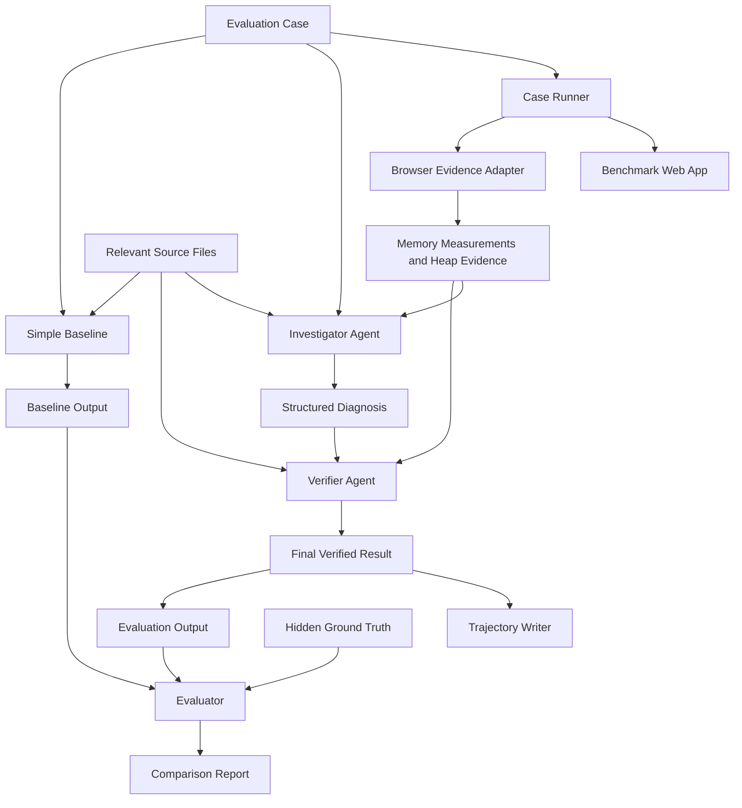

# HeapSleuth Project Plan

> Status: Active working document  
> Language: English for all project artifacts  
> Delivery window: 2 days  
> Team: One developer assisted by an AI coding collaborator

## 1. Executive Summary

HeapSleuth is an agentic workflow that reproduces, diagnoses, explains, and verifies memory leaks in frontend applications using runtime browser evidence.

The project is designed for frontend engineers and technical evolution teams that currently investigate memory leaks through a slow, specialist-heavy process involving issue reproduction, heap inspection, source-code analysis, hypothesis formation, and repeated verification.

HeapSleuth will compare two approaches on the same synthetic benchmark:

1. A simple baseline that asks a general-purpose language model to diagnose a case from its description and source code.
2. An agentic solution that reproduces the behavior in a browser, collects memory evidence, inspects relevant source code, forms a hypothesis, and asks an independent verifier to challenge the diagnosis.

The primary goal is not to build a universal debugging platform in two days. The goal is to demonstrate, with reproducible evidence, that controlled runtime investigation and verification improve memory-leak diagnosis over a reasonable static baseline.

## 2. Project Thesis

### Problem statement

Frontend memory leaks are difficult to diagnose because the visible symptom often appears far away from the root cause. Engineers must reproduce a user flow repeatedly, control for garbage collection, compare memory behavior, inspect retained objects, connect runtime evidence to source code, and verify that a suspected cause explains the observed growth.

### Intended user

Frontend engineers and technical evolution teams responsible for application performance, architectural health, and production reliability.

### Current bottleneck

The current workflow is manual, inconsistent, and dependent on specialized browser-debugging knowledge. Static code review can identify suspicious patterns, but it cannot reliably confirm whether a leak occurs during a specific user flow or distinguish a real leak from temporary memory growth.

### User value

HeapSleuth aims to reduce diagnosis time and produce a report that is:

- grounded in runtime evidence;
- explicit about uncertainty;
- localized to a source file and mechanism;
- reproducible by another engineer;
- verified against the same user flow.

### Hot take hypothesis

> Frontend debugging agents do not primarily need more reasoning. They need controlled reproduction, runtime evidence, and permission to reject their first hypothesis.

This wording is provisional. The final hot take must reflect an observed failure mode from the actual experiments.

## 3. Hackathon Alignment

HeapSleuth is designed to answer the four core hackathon questions:

| Question | HeapSleuth answer |
| --- | --- |
| Who has the problem? | Frontend engineers responsible for performance and architecture. |
| What bottleneck makes it worth solving? | Runtime memory diagnosis is slow, specialized, and difficult to reproduce consistently. |
| Does the agent solve it well? | This will be measured against a static baseline on the same benchmark cases. |
| Can another person reproduce the result? | The submission will include exact setup, baseline, solution, and evaluation commands. |

The project will prioritize purposeful agent design over the number of agents.

## 4. Scope

### MVP scope

The MVP must:

- run locally from a clean Node.js environment;
- start the synthetic benchmark application automatically;
- execute a deterministic interaction scenario for each case;
- collect memory-related runtime evidence before and after repeated interactions;
- provide source code and runtime evidence to an investigator agent;
- return a structured diagnosis with a verdict, root cause, evidence, and confidence;
- send the diagnosis to an independent verifier agent;
- save readable trajectories for every agent;
- run the same cases through a simple baseline;
- calculate and report the primary metric;
- include one challenging no-leak control case;
- produce an English reproduction guide and README.

### Stretch scope

Only attempt these items after every MVP acceptance criterion passes:

- generate a candidate code patch;
- apply the patch in an isolated copy;
- rerun the exact scenario and verify the memory behavior;
- render a small local results dashboard;
- support a user-provided local frontend project;
- add a second challenging non-leak case.

### Explicit non-goals

- production-ready support for arbitrary websites;
- cross-browser profiling;
- autonomous modification of external repositories;
- guaranteed automatic repair of every memory leak class;
- parsing and sending complete raw heap snapshots to the model;
- replacing a qualified engineer's final judgment;
- building a hosted multi-user SaaS product during the hackathon.

## 5. Architecture

### Technology choices

| Area | Planned choice | Reason |
| --- | --- | --- |
| Runtime | Node.js with TypeScript | Matches the frontend domain and keeps the project in one ecosystem. |
| Interface | Command-line interface | Fast to build, easy to reproduce, and suitable for automated evaluation. |
| Benchmark UI | Vite-based frontend application | Fast local startup and simple isolated routes for synthetic cases. |
| Browser control | Chrome DevTools MCP preferred; direct CDP/Playwright fallback | Provides runtime browser evidence while preserving a fallback if the preferred integration is unstable. |
| Model access | Provider adapter using an environment variable | Keeps credentials outside the submission and limits provider coupling. |
| Outputs | JSON for machines, Markdown for reviewers | Supports automated scoring and readable evidence. |
| Validation | Runtime schemas | Prevents malformed model output from silently corrupting the evaluation. |

Exact dependency versions will be pinned after the technical spike and recorded in the reproduction guide.

### High-level system diagram



### Execution flow

1. Load one benchmark case and its deterministic user scenario.
2. Start or reuse the local benchmark server.
3. Open the case route in an isolated browser context.
4. Warm up the page to reduce initialization noise.
5. Trigger garbage collection when supported.
6. capture a baseline memory sample or heap summary.
7. Repeat the case interaction and reversal for a fixed number of cycles.
8. Trigger garbage collection again.
9. Capture the final memory sample and targeted heap evidence.
10. Select only relevant source files and bounded evidence.
11. Ask the investigator to produce a structured diagnosis.
12. Ask the verifier to challenge the diagnosis and evidence.
13. Return an accepted diagnosis, a revised diagnosis, or an explicit inconclusive result.
14. Save the full trajectory and evaluation-ready output.

## 6. Agent Design

### Investigator Agent

#### Responsibility

Determine whether the scenario indicates a memory leak and localize the most likely mechanism and source location using the available runtime evidence.

#### Inputs

- case description;
- deterministic user scenario;
- relevant source files;
- before/after memory samples;
- targeted heap snapshot summaries or retaining-path evidence;
- browser console errors and selected runtime observations.

#### Required output

```json
{
  "caseId": "event-listener-leak",
  "verdict": "leak",
  "mechanism": "event_listener_without_cleanup",
  "rootCause": {
    "file": "src/cases/EventListenerLeak.tsx",
    "symbol": "EventListenerLeak"
  },
  "evidence": [
    {
      "source": "runtime",
      "claim": "Listener count increases after each mount and unmount cycle."
    }
  ],
  "confidence": 0.92,
  "recommendedFix": "Remove the listener in the effect cleanup function.",
  "limitations": []
}
```

#### Guardrails

- Do not claim a leak from a single high memory value.
- Do not cite evidence that was not provided by a tool.
- Distinguish temporary allocation from retained growth after garbage collection.
- Return `inconclusive` when the evidence is insufficient.
- Never access the hidden ground-truth file.

### Verifier Agent

#### Responsibility

Act as a skeptical reviewer. Attempt to falsify the investigator's conclusion before it becomes the final result.

#### Checks

- Does the evidence support the stated mechanism?
- Is the source location consistent with the retaining evidence?
- Could normal caching, warm-up, or delayed garbage collection explain the result?
- Did the investigator ignore contradictory observations?
- Is the confidence level justified?
- Should the result be accepted, revised, or marked inconclusive?

#### Required output

```json
{
  "decision": "accept",
  "issues": [],
  "revisedDiagnosis": null,
  "verificationSummary": "The repeated retained growth and listener-count increase support the diagnosis."
}
```

### Why only two agents

The investigator and verifier have distinct and testable responsibilities. Additional agents will not be added unless an experiment demonstrates a specific failure that a separate role can address.

## 7. Tool Boundaries

The agents may receive access only to bounded, auditable tools:

- `run_scenario(case_id)`
- `collect_memory_sample(case_id, phase)`
- `get_heap_summary(case_id, filters)`
- `get_retaining_paths(case_id, object_filter)`
- `read_source_file(path)`
- `search_source(query)`
- `read_console_events(case_id)`
- `save_diagnosis(result)`

The benchmark ground truth is available only to the evaluator, not to the agents.

Raw heap snapshots may be stored locally as temporary artifacts, but they should not be submitted or sent to the model unless required. The model should receive compact evidence summaries to control cost, latency, and context size.

## 8. Baseline Design

The baseline will use:

- the same model family as the agentic solution whenever possible;
- the same case description;
- the same relevant source files;
- one direct prompt;
- no runtime browser tools;
- no verifier;
- the same required diagnosis schema.

The baseline prompt will ask the model to identify whether a leak exists, the mechanism, and the likely source location. It will represent a reasonable static AI-assisted debugging approach.

Any difference in model, token budget, or available context must be disclosed in the final report.

## 9. Benchmark Dataset

### Dataset principles

- All cases will be synthetic and safe to share.
- Each case will have an explicit ground truth.
- Scenarios will be deterministic and runnable without external services.
- Cases will be isolated from one another.
- Leak mechanisms will be small enough to inspect but not directly named in the user-visible description.
- At least one case will be a healthy control designed to expose false positives.

### Target cases

| ID | Mechanism | Expected verdict | Priority |
| --- | --- | --- | --- |
| `event-listener` | Event listener without cleanup | Leak | P0 |
| `interval` | Interval not cleared on unmount | Leak | P0 |
| `resize-observer` | Observer not disconnected | Leak | P0 |
| `detached-dom` | Detached DOM subtree retained by JavaScript | Leak | P0 |
| `global-cache` | Unbounded global collection | Leak | P0 |
| `closure-registry` | Closure retaining a large payload | Leak | P0 |
| `event-bus` | Subscription not removed | Leak | P0 |
| `animation-frame` | Repeating animation callback not cancelled | Leak | P1 |
| `handler-identity` | Cleanup uses a different callback identity | Leak | P1 |
| `healthy-control` | Temporary allocation released after cleanup | No leak | P0 |

If time becomes critical, reduce UI complexity rather than reducing evaluation integrity. The ten-case target should be preserved if possible.

### Ground-truth schema

Each hidden answer will define:

- expected verdict;
- accepted mechanism labels;
- accepted source file;
- accepted symbol or function;
- required evidence category;
- explanatory notes used only by the evaluator.

## 10. Evaluation Plan

### Primary metric

**Root-Cause Localization Accuracy (RCLA)**

A case is counted as correct only when all of the following are true:

1. The leak/no-leak verdict is correct.
2. The diagnosed mechanism matches an accepted ground-truth mechanism.
3. For leak cases, the source file or symbol matches an accepted location.

```text
RCLA = correctly resolved cases / total evaluation cases
```

### Secondary metrics

- leak detection accuracy;
- false-positive rate on healthy controls;
- mechanism classification accuracy;
- source localization accuracy;
- evidence-grounding score;
- human time per case;
- runtime per case;
- estimated model cost per case;
- inconclusive-result rate.

### Evidence-grounding rubric

| Score | Description |
| --- | --- |
| 0 | No evidence or fabricated evidence. |
| 1 | Evidence is present but does not support the conclusion. |
| 2 | Evidence partially supports the conclusion but misses contradictions. |
| 3 | Evidence clearly supports the conclusion and acknowledges limitations. |

### Fairness controls

- Use the same evaluation cases for baseline and solution.
- Use the same ground-truth scorer.
- Keep ground truth inaccessible to both systems.
- Pin model and dependency versions.
- Use low-variance model settings where supported.
- Record failures instead of silently retrying until success.
- Document any retries and their reason.
- Run the healthy control through both approaches.

### Challenging case

The required challenging case will be `healthy-control`. It intentionally allocates memory during interaction but releases it after cleanup and garbage collection. It tests whether the system can avoid treating all memory growth as a leak.

## 11. Output Artifacts

### Per-case result

Each run will create:

```text
results/<approach>/<case-id>/
  result.json
  report.md
  metrics.json
  run-metadata.json
```

### Trajectories

Each agentic run will create:

```text
trajectories/<case-id>/
  investigator.jsonl
  investigator.md
  verifier.jsonl
  verifier.md
```

Trajectories must show:

- instructions;
- relevant inputs;
- tool calls and tool responses;
- intermediate diagnosis;
- verifier feedback;
- revision or acceptance;
- retries;
- human checkpoints, if any;
- final result.

Secrets, full hidden prompts from external services, and private reasoning traces must not be included. The trajectory should expose observable actions and decision summaries.

### Final comparison

```text
results/summary/
  comparison.json
  comparison.md
  changelog-evidence.json
```

## 12. Planned Repository Structure

```text
heapsleuth/
  README.md
  LICENSE
  package.json
  package-lock.json
  tsconfig.json
  .env.example
  .gitignore

  src/
    cli.ts
    config.ts
    orchestrator.ts

    agents/
      investigator.ts
      verifier.ts

    prompts/
      baseline.md
      investigator.md
      verifier.md

    browser/
      evidence-provider.ts
      chrome-devtools-mcp.ts
      direct-cdp-fallback.ts
      scenario-runner.ts

    model/
      model-provider.ts

    schemas/
      case.ts
      diagnosis.ts
      verification.ts
      trajectory.ts

    evaluation/
      evaluator.ts
      rubric.ts
      report-writer.ts

    telemetry/
      trajectory-writer.ts
      run-metadata.ts

  benchmark/
    package.json
    src/
      cases/
      scenarios/
      app/

  dataset/
    cases.json
    ground-truth.json

  results/
    baseline/
    solution/
    summary/

  trajectories/

  docs/
    PROJECT_PLAN.md
    IMPROVEMENT_CHANGELOG.md
    REPRODUCTION.md
    EVALUATION.md
    VIDEO_SCRIPT.md
```

The final implementation may simplify this structure. Avoid creating empty abstractions solely to match the plan.

## 13. Command Contract

The intended evaluator experience is:

```bash
npm install
cp .env.example .env
# Add the evaluator's API key to .env

npm run baseline
npm run solution
npm run evaluate
```

Convenience commands:

```bash
npm run setup
npm run benchmark
npm run demo -- --case detached-dom
npm run reproduce
npm test
```

`npm run reproduce` should run the benchmark server, baseline, agentic solution, and evaluation with minimal manual intervention.

Windows PowerShell equivalents must be included in `docs/REPRODUCTION.md` if any command differs.

## 14. Configuration and Security

The submission must include `.env.example` but never `.env`.

Example:

```env
AI_API_KEY=
AI_MODEL=
BROWSER_HEADLESS=true
RESULTS_DIR=results
```

Security requirements:

- never commit API keys;
- never print complete credentials in logs;
- restrict file tools to the project workspace;
- do not perform external consequential actions;
- keep benchmark data synthetic;
- document model-provider terms and required access;
- include approximate runtime and API cost.

## 15. Technical Spike and Pivot Rule

The browser-memory integration is the highest-risk dependency and must be tested before building the full dataset.

### Spike success criteria

Within the first 90 minutes, demonstrate that the program can:

1. launch the benchmark page;
2. run one open/close interaction repeatedly;
3. collect a before and after memory measurement;
4. retrieve at least one useful heap or retaining-path signal;
5. save the evidence as structured JSON.

### Pivot rule

If Chrome DevTools MCP cannot meet the spike criteria reliably, switch immediately to direct CDP/Playwright collection. Do not spend more than 90 minutes debugging the preferred adapter.

The fallback MVP may use:

- forced garbage collection;
- JavaScript heap measurements;
- DOM node and event listener instrumentation controlled by the benchmark;
- targeted source-code evidence;
- repeated-cycle growth analysis.

The fallback must remain honest about what it can and cannot prove.

## 16. Two-Day Execution Plan

### Day 1 - Build the evidence loop

#### Block 1: Project foundation - 1 hour

- [x] Initialize Node.js and TypeScript project.
- [x] Add linting, formatting, tests, and environment loading.
- [x] Add the planned directory structure only as needed.
- [x] Create `.env.example` and `.gitignore`.
- [x] Add structured schemas and run metadata.

#### Block 2: Browser evidence spike - 1.5 hours

- [x] Build one minimal leaking benchmark case.
- [x] Run the interaction automatically.
- [x] Collect before/after evidence.
- [x] Verify that the evidence survives garbage collection.
- [x] Decide Chrome DevTools MCP or direct CDP fallback.
- [x] Record the decision in the improvement changelog.

#### Block 3: Benchmark dataset - 3 hours

- [ ] Implement all P0 leak cases.
- [ ] Implement the healthy control.
- [ ] Add deterministic scenarios.
- [ ] Create hidden ground truth.
- [ ] Add automated smoke tests for every route and scenario.

#### Block 4: Baseline - 1.5 hours

- [ ] Implement the one-prompt baseline.
- [ ] Enforce the common result schema.
- [ ] Run the first baseline batch.
- [ ] Save all outputs, including failures.

#### Block 5: Investigator - 3 hours

- [ ] Implement bounded browser and source tools.
- [ ] Implement the investigator prompt.
- [ ] Add structured result validation.
- [ ] Save trajectories from the first working run.
- [ ] Test one leak case and the healthy control.

### Day 2 - Verify, evaluate, and package

#### Block 6: Verifier - 2 hours

- [ ] Implement the verifier prompt and schema.
- [ ] Add accept, revise, and inconclusive decisions.
- [ ] Ensure verifier feedback appears in trajectories.
- [ ] Test deliberate false-positive and weak-evidence scenarios.

#### Block 7: Full evaluation - 2 hours

- [ ] Complete remaining benchmark cases.
- [ ] Run baseline on every case.
- [ ] Run solution on every case.
- [ ] Calculate primary and secondary metrics.
- [ ] Investigate failures without hiding them.

#### Block 8: Evidence-driven iteration - 2 hours

- [ ] Identify the main failure mode.
- [ ] Make one focused improvement.
- [ ] Rerun the same evaluation.
- [ ] Keep or remove the change based on evidence.
- [ ] Update the improvement changelog immediately.

#### Block 9: Documentation and polish - 2.5 hours

- [ ] Complete `README.md`.
- [ ] Complete clean-environment reproduction guide.
- [ ] Record exact dependency and model versions.
- [ ] Record runtime and cost.
- [ ] Produce final comparison tables.
- [ ] Select representative trajectories for both agents.
- [ ] Check that all project artifacts are in English.

#### Block 10: Video and submission - 2 hours

- [ ] Write the five-minute video script.
- [ ] Rehearse a deterministic demo case.
- [ ] Record problem, baseline, execution, comparison, and changelog.
- [ ] Highlight the highest-impact change.
- [ ] Include one removed experiment.
- [ ] Create the final ZIP.
- [ ] Test the ZIP from a clean directory.

## 17. Prioritized Backlog

### P0 - Submission blockers

- [ ] Reproducible benchmark application.
- [ ] At least one healthy control.
- [ ] Static baseline.
- [ ] Runtime-evidence investigator.
- [ ] Independent verifier.
- [ ] Ground-truth evaluator.
- [ ] Complete results for all submitted cases.
- [ ] Improvement changelog based on real experiments.
- [ ] Representative trajectories for every agent.
- [ ] Clean-environment reproduction guide.
- [ ] English README and documentation.
- [ ] Five-minute solution video.
- [ ] Final ZIP without credentials or private data.

### P1 - High-value enhancements

- [ ] Ten total benchmark cases.
- [ ] Human-readable Markdown reports.
- [ ] Automated cost and runtime tracking.
- [ ] One-click reproduction command.
- [ ] Small visual summary for the video.
- [ ] Candidate patch generation for one supported mechanism.

### P2 - Only if time remains

- [ ] Automatic patch application in an isolated copy.
- [ ] Memory improvement verification after patching.
- [ ] User-provided repository support.
- [ ] Hosted demo.
- [ ] Additional model-provider adapter.

## 18. Improvement Changelog Strategy

The changelog must report actual experiments, not planned success. Create an entry immediately after every meaningful change.

Expected experiment sequence:

| Stage | Experiment | Evidence to capture |
| --- | --- | --- |
| Baseline | Static one-prompt diagnosis | RCLA, false positives, qualitative failures |
| Iteration 1 | Add browser memory evidence | Metric delta and changed failure modes |
| Iteration 2 | Add targeted heap or retaining evidence | Localization delta and cost/latency |
| Iteration 3 | Add independent verifier | False-positive and evidence-grounding delta |
| Removed experiment | To be determined from actual work | Why it failed and what it taught us |
| Final | Keep only changes supported by evidence | Final comparison |

Do not fabricate the removed experiment. If no planned feature is removed naturally, deliberately test one reasonable alternative and report the honest result.

## 19. Risks and Mitigations

| Risk | Impact | Mitigation |
| --- | --- | --- |
| Heap snapshots are too large or slow | Blocks agent context and evaluation | Send bounded summaries, cache locally, and use the pivot rule. |
| Garbage collection creates noisy measurements | Causes false positives | Warm up, force GC when supported, repeat cycles, and include a healthy control. |
| Browser integration is unstable | Breaks reproducibility | Complete the spike first and preserve a direct CDP fallback. |
| Model output is inconsistent | Weakens evaluation | Use schemas, low-variance settings, explicit inconclusive state, and full failure logs. |
| Ground truth leaks into prompts | Invalidates results | Store it in an evaluator-only path and test agent file boundaries. |
| Ten cases take too long | Threatens submission quality | Reuse one benchmark shell and implement small isolated mechanisms. |
| Scope expands into automatic repair | Delays the core result | Treat patching as stretch scope until diagnosis metrics pass. |
| API credentials leak | Disqualifies or creates security risk | Use `.env.example`, secret scanning, and final ZIP inspection. |
| Live demo fails | Hurts presentation | Use one deterministic case and keep representative saved results as backup. |
| Project appears AI-generated or unfinished | Reduces end-to-end quality | Edit all prose, remove placeholders, verify every command, and test the final ZIP. |

## 20. Definition of Done

The project is ready for submission only when:

- [ ] A new user can follow the reproduction guide from a clean directory.
- [ ] The baseline and agentic solution run on the same cases.
- [ ] The evaluation produces the documented primary metric.
- [ ] All submitted result claims link to saved evidence.
- [ ] The healthy control is included and explained.
- [ ] Every agent has a representative readable trajectory.
- [ ] All meaningful iterations are documented honestly.
- [ ] Runtime, cost, model, and dependency versions are documented.
- [ ] No API key, `.env`, personal data, or private file is present.
- [ ] The final output is polished and entirely in English.
- [ ] The video is no longer than five minutes.
- [ ] The final ZIP has been extracted and tested independently.

## 21. Submission Package Checklist

The final ZIP should contain:

- [ ] complete source code;
- [ ] all agent instructions and prompts;
- [ ] `README.md`;
- [ ] `docs/REPRODUCTION.md`;
- [ ] `docs/IMPROVEMENT_CHANGELOG.md`;
- [ ] evaluation methodology and complete results;
- [ ] representative investigator and verifier trajectories;
- [ ] synthetic benchmark data;
- [ ] `.env.example`;
- [ ] exact dependency lockfile;
- [ ] video file or permitted video link;
- [ ] license and third-party attribution;
- [ ] no `node_modules` directory;
- [ ] no temporary heap snapshots unless intentionally included and documented;
- [ ] no credentials or private information.

## 22. Should This Planning File Be Submitted?

Keep this file in the project repository during development. It is useful for controlling scope, preserving architecture decisions, and coordinating the two-day execution.

For the final ZIP:

- Include it if every status, decision, and checklist item has been updated and it strengthens the engineering story.
- Exclude it if it still contains stale assumptions, unfinished TODOs, or internal notes that contradict the final implementation.
- The required submission documents are the README, reproduction guide, improvement changelog, complete code, evaluation evidence, video, and agent trajectories. This planning file is helpful but not mandatory.

The recommended final decision is to keep a cleaned, accurate version under `docs/PROJECT_PLAN.md` as supporting documentation.

## 23. Immediate Next Actions

1. Approve the problem statement and MVP boundary.
2. Initialize the Node.js/TypeScript repository.
3. Implement the 90-minute browser-memory evidence spike.
4. Record the first real architecture decision in the improvement changelog.
5. Continue only after the spike produces structured runtime evidence.
